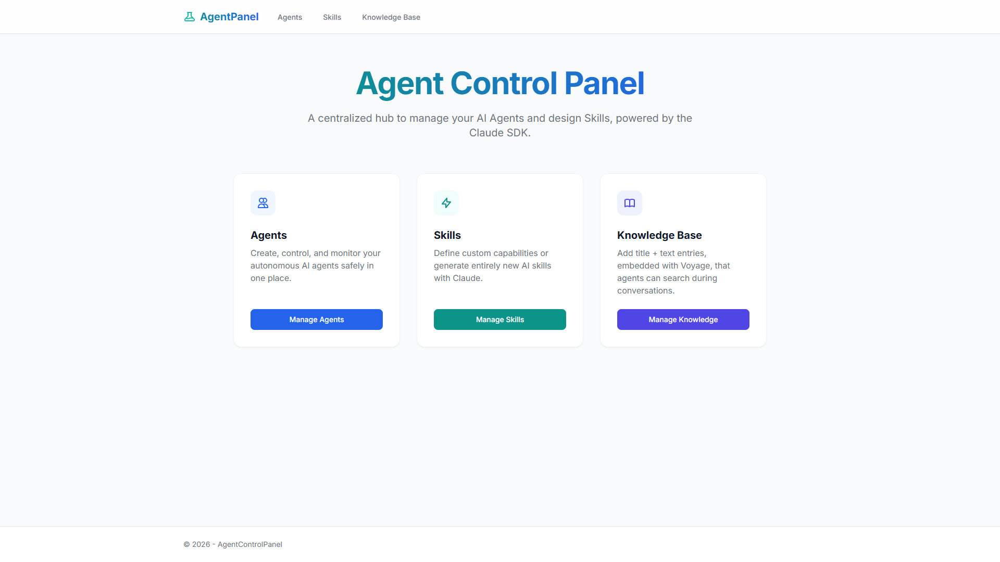
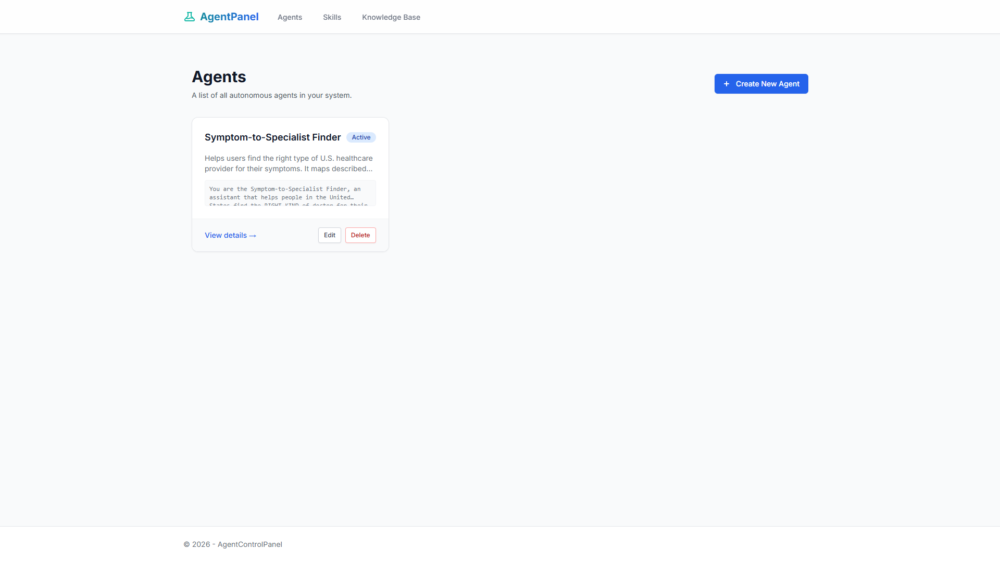
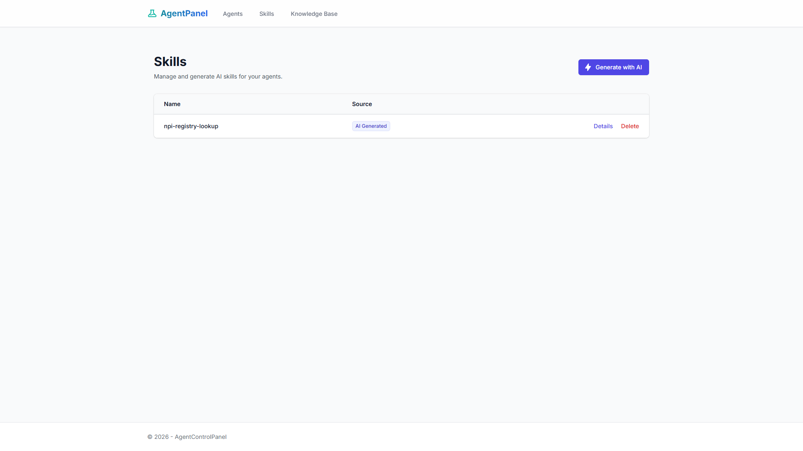
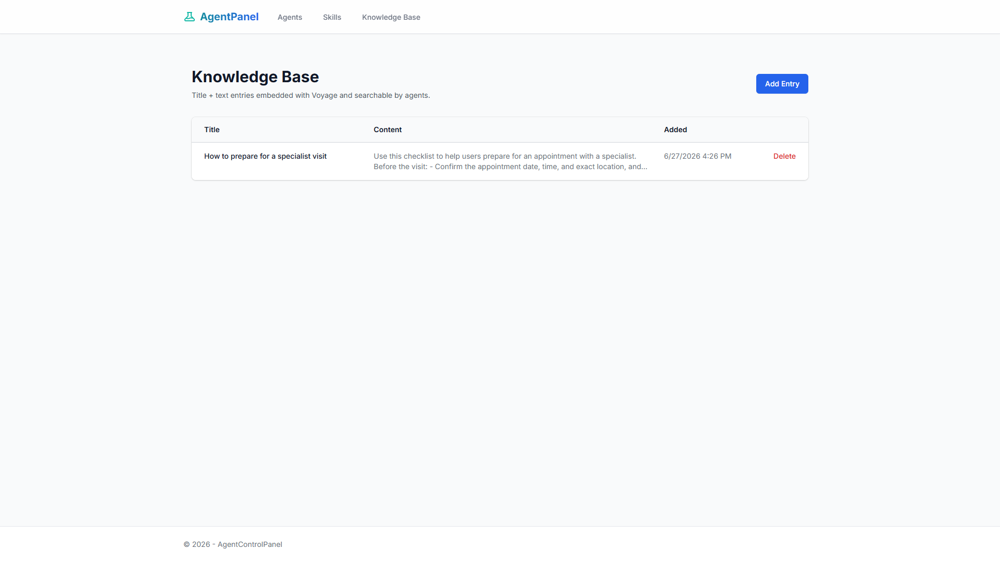
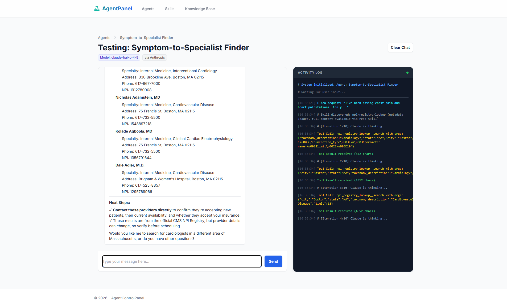

# Agent Control Panel

A small, runnable **proof-of-concept** that shows how to build a Claude-powered agent platform from scratch — no agent framework, just the official Claude SDK, a clean provider abstraction, and ASP.NET Core. You create agents, give them **skills** and a **knowledge base**, pick which Claude model each one runs on, and chat with them live while watching every tool call in an activity log.

> ⚠️ This is a demo / learning project, not a production system. It runs unauthenticated on localhost with a single shared Postgres instance.

---

## What it is

**Agent Control Panel** is an ASP.NET Core MVC app (.NET 10) that lets you:

- **Create agents** — name, description, system prompt, and the **Claude model** each agent runs on (Opus 4.8 / Sonnet 4.6 / Haiku 4.5).
- **Author skills** — reusable capabilities defined as a `SKILL.md` (YAML frontmatter + Markdown instructions) plus optional executable **scripts** (Python / JS / Bash). Skills can be **generated by Claude** from a one-line description.
- **Build a knowledge base** — paste a Title + Text; it's embedded with **Voyage AI** and stored in Postgres using **pgvector** for semantic search.
- **Talk to your agents** — a Test Agent chat page that streams the agent's reasoning loop, including every tool call and result.

Under the hood it demonstrates a few patterns worth stealing:

- **Swappable LLM provider** — a neutral `ILlmProvider` interface with two implementations: `AnthropicLlmProvider` (direct `api.anthropic.com`, the default) and `BedrockLlmProvider` (AWS Bedrock). Switch with one config value.
- **Progressive skill disclosure** — agents see only lightweight skill *metadata* in the system prompt, then load full instructions on demand via a `read_skill` tool (cheap on tokens, scales to many skills).
- **Tool-use loop** — the agent can call tools, get results, and keep going for up to 10 iterations per message.
- **Native RAG tool** — when an agent has the knowledge base enabled, it gets a `search_knowledge_base` tool handled in C# (embed query → pgvector cosine search → return top matches).

---

## Who it's for

- **Developers exploring the Claude SDK** who want a concrete, end-to-end example beyond "hello world" — tool use, multi-turn loops, system prompts, model selection.
- **Teams evaluating an agent architecture** who want to see a clean provider abstraction (Anthropic vs. Bedrock) and a skills/RAG design before committing to a framework.
- **Anyone learning RAG with pgvector** — a minimal, readable embed-and-search implementation using Postgres instead of a dedicated vector DB.

## Why it's interesting

- It's **framework-free**: you can read the whole agent loop in one file (`Services/ConversationService.cs`) and understand exactly how tool use works.
- It shows **two retrieval/skill models side by side**: subprocess-executed skill scripts *and* a native database-backed RAG tool.
- **Claude builds Claude's tools**: the "Generate skill with AI" feature has Claude author a spec-compliant `SKILL.md` + scripts for you.

---

## Screenshots

**Dashboard** — entry point to Agents, Skills, and the Knowledge Base.



**Agents** — each agent has its own Claude model, system prompt, skills, and knowledge-base toggle.



**Skills** — reusable `SKILL.md` + script capabilities; generate new ones with Claude via the "Generate with AI" modal.



**Knowledge Base** — Title + Text entries embedded with Voyage and stored in pgvector for semantic retrieval.



### Example: a Symptom-to-Specialist Finder agent in action

This agent maps a described symptom to a medical specialty, then calls the `npi-registry-lookup` skill to find **real, licensed providers** from the official CMS NPI Registry. The **Activity Log** on the right shows the live tool-use loop — Claude calling `npi_registry_lookup__search`, refining the specialty (`Cardiology` → `Cardiovascular Disease`), and composing the final answer.

> *Prompt:* "I've been having chest pain and heart palpitations. Can you help me find a cardiologist near Boston, MA?"



---

## Architecture at a glance

```
Browser (Razor + Tailwind)
        │
        ▼
ASP.NET Core MVC  ──► ConversationService ──► ILlmProvider ──► Claude (Anthropic API or Bedrock)
        │                     │
        │                     ├─ read_skill / <skill>__<script>  (subprocess: python/node/bash)
        │                     └─ search_knowledge_base ──► IEmbeddingProvider (Voyage) ──► pgvector (Postgres)
        ▼
Postgres + pgvector  (Agents, Skills, KnowledgeDocuments)
```

**Key components**

| Area | Where |
|---|---|
| Agent tool-use loop | `Services/ConversationService.cs` |
| LLM provider abstraction | `Services/Llm/` (`ILlmProvider`, `AnthropicLlmProvider`, `BedrockLlmProvider`) |
| Embeddings (Voyage) | `Services/Embeddings/` (`IEmbeddingProvider`, `VoyageEmbeddingProvider`) |
| Knowledge base + pgvector search | `Services/KnowledgeBaseService.cs` |
| Skill parsing/validation | `Services/SkillParser.cs` |
| Data model | `Models/AppModels.cs`, `Data/AppDbContext.cs` |
| Startup / DI / rate limiting | `Program.cs` |

---

## Tech stack

- **.NET 10** / ASP.NET Core MVC (Razor views, Tailwind via CDN)
- **PostgreSQL** + **pgvector** (`pgvector/pgvector:pg18` Docker image)
- **EF Core 10** + Npgsql (auto-migrates on startup)
- **Anthropic** .NET SDK (Claude) — default; **AWS Bedrock** as an alternative provider
- **Voyage AI** REST embeddings (`voyage-4-lite`, 1024-dim)
- Global **rate limiting** (5 requests / minute, built-in `System.Threading.RateLimiting`)

---

## Prerequisites

- [.NET 10 SDK](https://dotnet.microsoft.com/download)
- [Docker](https://www.docker.com/) (for the Postgres + pgvector container)
- An **Anthropic API key** — https://console.anthropic.com/ → API Keys
- A **Voyage AI API key** — https://dashboard.voyageai.com/ → API Keys

---

## Setup

### 1. Configure secrets

Copy the template and fill in your two keys:

```bash
cp .env.example .env        # PowerShell:  Copy-Item .env.example .env
```

Edit `.env`:

```dotenv
ANTHROPIC_API_KEY=sk-ant-...        # required to run agents
VOYAGE_API_KEY=pa-...               # required for the knowledge base
POSTGRES_USER=postgres
POSTGRES_PASSWORD=postgres
```

Keys are read from the environment (the app loads `.env` via `DotNetEnv` on startup) or from `appsettings.json` under `Llm:Anthropic:ApiKey` / `Voyage:ApiKey`. If a key is missing the app still starts — Claude calls return an error and the knowledge base reports that the embedding key is not configured.

### 2. Start Postgres (with pgvector)

```bash
docker compose up -d
```

This starts `agent-control-panel-db` on `localhost:5432` (database `AgentControlPanel`).

### 3. Run the app

```bash
dotnet run --project AgentControlPanel.csproj
```

On startup the app **auto-applies EF Core migrations** — creating the `vector` extension, the `Agents` / `Skills` / `KnowledgeDocuments` tables, etc. No manual `dotnet ef` step needed.

Open the URL printed in the console (typically `https://localhost:5xxx`).

### 4. (Optional) Load the demo data

To start with a ready-made example — the `npi-registry-lookup` skill, a "Symptom-to-Specialist Finder" agent, and a sample knowledge base entry (shown in the screenshots above) — run the seed script after the schema exists:

```bash
docker exec -i agent-control-panel-db \
  psql -U postgres -d AgentControlPanel < Data/seed-demo-data.sql
```

The script is idempotent, so it's safe to re-run.

---

## Play with it

1. **Add knowledge** → *Knowledge Base → Create*. Add a couple of entries, e.g.
   - *Title:* `Refund policy` · *Content:* `Customers can request a full refund within 30 days of purchase...`
   - *Title:* `Office hours` · *Content:* `Support is available Mon–Fri, 9am–5pm CET.`
   Each entry is embedded with Voyage and stored as a vector.

2. **Create an agent** → *Agents → Create*. Give it a name and system prompt, pick a model, and tick **Enable knowledge base access**.

3. *(Optional)* **Add a skill** → *Skills → Create*, or hit **Generate with AI** and describe what you want (e.g. *"convert between currencies"*). Claude writes a spec-compliant `SKILL.md` + script. Attach the skill to your agent.

4. **Chat** → open the agent's **Test Agent** page and ask something only the knowledge base knows: *"What's your refund policy?"* Watch the **Activity Log** — you'll see the agent call `search_knowledge_base`, get the matching entry, and answer from it.

5. **Experiment**: turn the KB toggle off and ask again (the tool disappears); switch the agent's model; attach a script-backed skill and watch it run a subprocess.

---

## Configuration reference

`appsettings.json` holds the non-secret defaults:

```jsonc
{
  "Llm": {
    "Provider": "Anthropic",          // or "Bedrock"
    "DefaultModel": "claude-opus-4-8",
    "MaxTokens": 4096,
    "Models": [ /* dropdown options for per-agent model selection */ ]
  },
  "Voyage": {
    "Model": "voyage-4-lite",         // free-tier model, 1024-dim
    "OutputDimension": 1024           // MUST match the vector(1024) column
  }
}
```

**To use AWS Bedrock instead of the Anthropic API:** set `Llm:Provider` to `Bedrock` and configure AWS credentials in your environment (standard AWS SDK credential chain).

**Changing the Voyage model:** `voyage-4-lite` / `voyage-4` / `voyage-4-large` all support 1024-dim output, so swapping among them needs no DB change. Changing `OutputDimension` requires altering the `vector(N)` column (a new migration) and re-embedding existing rows.

---

## Project layout

```
AgentControlPanel/
├─ Program.cs                     # DI, rate limiter, pgvector data source, .env loading
├─ appsettings.json               # non-secret config (committed)
├─ .env.example                   # secret template (committed)  →  copy to .env (gitignored)
├─ docker-compose.yml             # Postgres + pgvector
├─ Controllers/                   # Home, Agent, Skill, KnowledgeBase
├─ Models/AppModels.cs            # Agent, Skill, KnowledgeDocument, ...
├─ Data/                          # AppDbContext, EF Core migrations, seed-demo-data.sql
├─ Services/
│  ├─ ConversationService.cs      # the agent tool-use loop
│  ├─ KnowledgeBaseService.cs     # embed + pgvector search
│  ├─ SkillParser.cs              # SKILL.md frontmatter parsing/validation
│  ├─ Llm/                        # ILlmProvider + Anthropic & Bedrock impls
│  └─ Embeddings/                 # IEmbeddingProvider + Voyage impl
└─ Views/                         # Razor + Tailwind UI
```

---

## Troubleshooting

| Symptom | Fix |
|---|---|
| `Voyage API key not configured` in the KB | Set `VOYAGE_API_KEY` in `.env` and restart. |
| Claude calls return an error / 400 | Set `ANTHROPIC_API_KEY` in `.env`; check the key is valid. |
| `429 Too Many Requests` | Expected — the global limiter allows 5 requests/min. Wait a minute. |
| App can't reach the database | Ensure the Docker container is up (`docker ps`) and `5432` isn't taken. |
| Migration / `vector` extension errors | Make sure the container uses the **pgvector** image (`pgvector/pgvector:pg18`), not plain `postgres`. |

---

## Security notes

- Skill scripts execute as **local subprocesses** with the host's permissions — only attach skills you trust.
- The app has **no authentication** and is intended to run locally, not exposed publicly.
